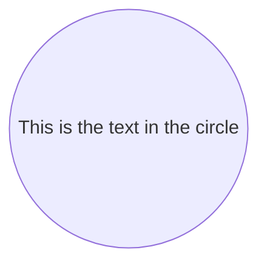

# smartdown

> smartdown - A Javascript library for translating, rendering, and interacting with Smartdown documents.

Smartdown is a *declarative*, *literate* and *reactive* authoring technology for writing technical and non-technical documents that are compelling and easy to share and publish within many existing forums and blogging systems. Smartdown is designed for blogging, technical communication, and teaching. Smartdown simplifies the creation of *Explorable Explanations*, which are prose documents with embedded interactive content such as charts, graphs, and featherweight programs called *playables*.

Smartdown extends the simple expressivity of the [Markdown](https://en.wikipedia.org/wiki/Markdown) language commonly used on blogs, messaging systems, technical forums, and on [GitHub](https://help.github.com/articles/basic-writing-and-formatting-syntax/). The Smartdown **engine** is a Javascript library that interprets the content in these Smartdown source files and enacts the desired behavior and presentation.


## Markdown and Smartdown

[Markdown](https://en.wikipedia.org/wiki/Markdown) is an easy-to-learn set of conventions for annotating text for structure and formatting purposes. Markdown embraces the simple principle that the information in a document should be *readable by default*, and that any additional formatting syntax should be unobtrusive to this readability. Smartdown extends Markdown with additional media and content types for enhanced expressivity, and adds its own features including *cells*, *playables*, and *reactivity*.

I think that this principle is important when teaching students (of any age) how to present their ideas and eventually, to visualize their ideas. Unlike HTML and other syntax-restrictive media, Markdown enables an idea to be expressed in a crude form, and then iteratively refined into an ever-better expression of the idea. Sometimes that is simply a blog post with nicely formatted text and embedded graphics. Sometimes it might be an interactive webpage with P5JS graphics, an Explorable Explanation.

There are several variants of the original Markdown language; Smartdown adopts the GitHub-flavored Markdown variant as its base language. The basic elements of most Markdown implementations are described in this [Markdown Cheatsheet](https://github.com/adam-p/markdown-here/wiki/Markdown-Cheatsheet).

### Smartdown Cells

Smartdown utilizes Markdown's link syntax and if it detects a Smartdown-formatted link, it replaces the link with a Smartdown *cell*, which can act as input, output, computation and more. A subset of the currently valid Smartdown cell types is below:

- Tunnels: `[Link Label](:@Location)`
- Input Cells: `[Input Label](:?VarName)`
- Output Cells: `[Output Label](:!VarName)`
- Calculation Cells: `[Calculation Label](:=Expression)`
- Checkbox Cells: `[Checkbox Label](:XVarName)`
- Tweet: ``
- Tweet+: ``

See [Cells](https://smartdown.site/lib/#Cells) for detailed examples of Smartdown Cells.

### Smartdown Playables

Smartdown extends Markdown's idea of *code blocks* with the option of making such code *playable*. For example, the code for a [Mermaid](https://mermaidjs.github.io) diagram can be displayed normally using a code block; however, by using Smartdown's `/playable` qualifier, the code can be executed and rendered within the document via the Smartdown-generated Play/Pause buttons:

````markdown

````

There is also an `/autoplay` option, which will ensure that the playable content is executed when the Smartdown card is loaded. These two options may be combined to produced autoplay content that may be manually played and paused. The use of `/autoplay` without a corresponding `/playable` will result in a playable that cannot be paused or its source displayed, which is often useful.

## Philosophy

[Smartdown](http://smartdown.site) is a flexible system for authoring and interacting with [Explorable explanations](https://medium.com/@Max_Goldstein/exploring-explorable-explanations-92f865c8d6ba#.10uo10u6k), which are *micro-apps* composed of text, multimedia and code. Smartdown notebooks are written using an enhanced version of Markdown called **Smartdown**, which integrates MarkDown's ease-of-use with a reactive process engine.

Users of this technology include teachers, students, bloggers, and anyone who wants to easily create and publish their ideas, research, questions or explanations. The mission of Smartdown is to nurture idea inspiration, simplify the process of creation, and to encourage sharing and exploration of the resulting knowledge.

Smartdown is intended for teacher and student alike; the philosophy being that the best ways to learn a skill or concept are to **use it** and to **teach it**. A teacher might produce a Smartdown notebook for the purposes of teaching, and may then assign a student the task of *explaining* a learned concept by authoring their own notebook, which can then be shared (*show and tell* is a powerful technique).

## FAQ

- **Is this Beta Software?** Yes. It is useful and usable, but it lacks many of the finishing touches necessary for it to be complete.
- **Is this open source?** No, not yet. It is currently *Copyright Dan Keith, 2015*. I'm currently working on establishing a core team of developers and the necessary license agreements to assure sustainability of the project. Please contact [feedback@infoclay.com](mailto:feedback@infoclay.com) if you'd like to help, have advice, or want to cheer me on.
- **How are you going to make a living off of this?** I have no idea! Smartdown is something I want to exist. I'm hoping that someone else finds it useful and that maybe there will be a way for me to keep working on it. Right now, it's a weekend and spare time project unassociated with my day job.
- **How can I provide feedback?** - Send an email to [feedback@infoclay.com](mailto:feedback@infoclay.com); any feedback is appreciated. I am working on creating a more flexible and interactive means of user feedback.
- **What is InfoClay?** InfoClay is the name of an interactive authoring environment wherein Smartdown was initially conceived, and then isolated as a separate library. InfoClay is still under development as [KnowBench](https://knowbench.com), but my priorities have been on stabilizing and releasing Smartdown. But in much of the documentation and examples, InfoClay and Smartdown mean the same thing: markdown-based, interactive, reactive explorable explanations.

## Ways to Share and Publish Smartdown

This repository contains several tools and example web applications to illustrate Smartdown usage. The simplest one shows how to create a Smartdown-enabled site by including the Smartdown library and initializing it with content. The more complex one creates a web application that is able to dynamically accept and render Smartdown documents from a user, via drag-and-drop, file upload, or a URL parameter.

### Simple Viewer Site

Visible at [https://smartdown.site/lib](https://smartdown.site/lib), this simple Smartdown-enabled site renders a set of Smartdown files. Unlike the Smartdown Source Viewer Site below, this site does not support editing or the display of the Smartdown source files. It's basically an example of a static site of Smartdown content; in this case, the Smartdown Example Gallery.

The Simple Viewer Site does support the ability to view arbitrary Markdown or Smartdown files by appending the desired URL to the above URL, along with a hash (`#`) marker. For example, the following Markdown file:

[`https://cdn.rawgit.com/mozilla/mentat/ae91603b/README.md`](https://cdn.rawgit.com/mozilla/mentat/ae91603b/README.md)

can be viewed via the URL:

[`https://smartdown.site/lib/#https://cdn.rawgit.com/mozilla/mentat/ae91603b/README.md`](https://smartdown.site/lib/#https://cdn.rawgit.com/mozilla/mentat/ae91603b/README.md)


### Smartdown Source Viewer Application

The Smartdown Source Viewer application displays the same Gallery examples as above, but also supports a `Show Source` option which enables a user to view and edit the Smartdown source code, although these changes are not currently saved. Additonally, the Smartdown Source Viewer can be load and display local files selected via drag-and-drop, or by specifying the URL of a cloud-based Smartdown file as in the Simple Smartdown Viewer above.

For example, the URL above can be viewed via the Smartdown Source Viewer

[`https://smartdown.site/#https://cdn.rawgit.com/mozilla/mentat/ae91603b/README.md`](https://smartdown.site/#https://cdn.rawgit.com/mozilla/mentat/ae91603b/README.md)


### Using GitHub Gists to store Smartdown files

See [Gists](https://smartdown.site/lib/#Gists) for details on how Smartdown deals with Gists.

See [Smartdown Via Gists](https://smartdown.site/gist/#DoctorBud/3b5cbab3424e08199b8046cf98d19c8f/Home) for a very detailed tutorial on how to author Smartdown documents in GitHub Gists and then display.


### Via a Blog

Needs more documentation.

Use [`starter.js`](https://unpkg.com/smartdown/docs/lib/starter.js) and [`index.html`](https://unpkg.com/smartdown/docs/lib/index.html) as guidance.

### Via Wordpress

Needs more documentation.

Use [`starter.js`](https://unpkg.com/smartdown/docs/lib/starter.js) and [`index.html`](https://unpkg.com/smartdown/docs/lib/index.html) as guidance.


### Via SmartdownPreview

For SublimeText users, we have a plugin that takes a directory of Smartdown files and colocated resources and then bundles them into an easily shareable and published `.html` file. See [SmartdownPreview](https://github.com/LanGuo/SmartDownPreview/) for details.


## Contributing

### Pre-Release Warning

This software is still incomplete in its implementation, documentation, and attribution. I intend to add much better documentation as well as proper citation of the software I use. Right now, the only way to test it in the real world is to deploy it with a bunch of disclaimers like this one.

### Licensing and Open Source

I will be making this project Open Source, but am still determining the proper license and getting all my release processes in place. Until then, the GitHub repository for `smartdown` will remain a Private repository and the software will be Copyright 2015, Daniel B Keith.

### Contact Info

Principal Author: Daniel B Keith
email: [feedback@infoclay.com](mailto:feedback@infoclay.com)
Twitter: @TheDoctorBud
GitHub: DoctorBud
Blog: [https://doctorbud.com](https://doctorbud.com)

## Release History

- **0.0.1** Initial release
- **0.0.2** Fix README
- **0.0.3** Incorporate Twitter, Video, P5JS, and other features from InfoClay.
- **0.0.4** Hack around issue with P5 Sound. Update P5 version. Add more documentation.
- **0.0.5** Add documentation about deployment via `npm` and CDN. Fix `xypic.js` issue with MathJax that prevents loading via WordPress. Perform loading of SVG content in `initialize`.
- **0.0.6** Decreased load time massively by adopting async patterns. Increased performance and predictibility by controlling MathJax more than the default.
- **0.0.7** Call the post-load hook correctly, rather than calling the result of calling the post-load hook.
- **0.0.8** CSS Fixes to increase WordPress compatibility. Adds Input, Checkbox, Output, Calc, and GoTo link styles. Adds setHome() function. Renames toHTML() to setSmartdown(). Enhances /example. Adds 'npm run clean'. Adds registerP5() to allow container code to autoplay P5 scripts. Allows SVG URLs or SVG strings to be used. Deals with Twitter not being loaded gracefully.
- **0.0.9** Improved README documentation. Enhanced the examples in /examples/. Added table styling. Fix bug in `loadCardsFromDocumentScripts`. Adopt 'Smartdown' vs 'SmartDown' as the name of the module.
- **0.0.10** Fix issues with P5 audioContext not being suspended properly on visibilityChanged. Inhibit auto-zoom on iOS Safari. Extends example.md with chemistry. Adjusts some P5 examples to respect window size changes. Use `env` instead of `ic` to pass smartdown variables to P5.
- **0.0.11** Adds preliminary external data query capability to Smartdown cells. Adds WikiData data query to example. Improves the Conic Section example. Uses `onkeyup` instead of `onchange` for input cell reactivity. Ensure Smartdown variables are initialized to the empty string.
- **0.0.12** Adds more SVGs from game-icons.net. Adds a fallback soundURL so that the P5JS Damscray_DancingTiger.mp3 example sound is obtained from unpkg.com. Simplifies references to in-package resources so that external users of SmartDown can use WebPack.
- **0.0.13** Adds Mermaid. Fixes example to be visible on GitHub Pages.
- **0.0.14** Fixes package.json to refer to docs/lib/smartdown.js
- **0.0.15** Performance improvements. Adds a /site application which enables viewing of Smartdown docs. Adds Graphviz-compatible viewer viz.js. Updates dependencies.
- **0.0.16** Remove legacy references to InfoClay assets. Add [Plotly.js](https://plot.ly/javascript/) support. Lazily-initialize Mermaid due to issues with the Mermaid logging system in v7.0. Upgrade to Webpack 2. Use PostCSS. Modernize AngularJS and other NPM modules. Add hacky 'kludgesrc' directory due to some side-effect of Webpack 2 upgrade. Disable auto-repeat of keys in p5 due to a bug in the key 'sticking'.
- **0.0.17** Delete unused logging. Added beginnings of conditional and lazy loading of MathJax, Mermaid and other large, optional modules.
- **0.0.18** Support optional inclusion of large modules like viz.js, plotly.js. Add very simple standalone example. Add multipart capability to allow several cards to be encoded in a single document. Improve Plotly behavior. Add backquote-based indirection to smartdown lookup syntax.
- **0.0.19** Fix bug ensuring MathJax executes when Mermaid is used. Add initial support for a Reload button, which works in Chrome but not Safari.
- **0.0.20** Add a CodeMirror-enabled editing mode to the viewer site, although there is no explicit Save operation yet. Fix a bug in XyJax that caused a harmless exception during processing of left/right braces, parentheses and brackets (e.g., `$\left(foo\right)$`). Added preliminary support for AsciiMath syntax via `@foo@`. Fixed (hack) a problem with P5JS Sound where suspend/resume didn't work properly.
- **0.0.21** Add optional `player` keyword to image URL titles so enable play/pause of GIF. Revert P5 to 0.5.7 due to bug in 0.5.8 that inhibited touches on iOS Safari.
- **0.0.22** Restore P5JS 0.5.8. Work around bug in 0.5.8 with monkeypatch. Fix duplicate startAutoplay() calls. Ensure btn-mobile-button classes are available in core smartdown.
- **0.0.23** Update packages. Add D3 Sankey, Make Twitter load lazily.
- **0.0.24** Fix MathJax CDN
- **0.0.25** Generalize the idea of playable/autoplay content such as P5JS, Plotly, Mermaid, etc. Refactored so that Mermaid diagrams are rendered more efficiently. Added 'd3' as a content type. Unified how the Smartdown environment is made available to playable content. Adds Leaflet.js. Cleans up CSS styling so that cells can be inlined or newlined depending on whether a label is present.
- **0.0.26** Fix reference to MP3 example file to point to /lib/resources/. Reduce bundle size by eliminating bulky example files. Update Babel to latest. Add support for MP3 embedding. Fix multipart handling so that a nested multipart doesn't erase the map. Add GeoLocation example. Begin adding mocha tests.
- **0.0.27** Removed unnecessary (and possibly, bloating) viz.js import from the Smartdown Viewer app. Modernized webpack config for the viewer app, including the use of noParse and aliases and vendor bundles to manage the bundle size. Change default soundURL to use unpkg.com due to CORS issues with CloudFlare.
- **0.0.28** Add linkRewrite rules (optional) to smartdown.initialize(), so that URLs can be rewritten prior to HTML expansion. Add favicon.ico.
- **0.0.29** Consistify CSS and Fonts. Eliminate horizontal scrolling issues due to SVG and MathJax. Clean up CSS. Use Asap and UbuntuMono fonts. Increase default font-size to 16px. Fix cells so that they can handle multiline input and output. Use bootstrap-theme for SimpleSiteExample and SmartdownViewer.
- **0.0.30** Improve WebPack minimization. Load viz.js dynamically rather than bundling it.
- **0.0.31** Add WikiData handlers as an optional default. Ensure that 'smartdown' is a window global variable for use by these handlers. Improve keydown-handler to be aware of keydown target when inhibiting arrow/space keys. Add Sound On/Off to Games.md example. Styling improvements for code/pre.
- **0.0.32** Use div for infocell-output rather than span, to allo for pre blocks to be 100%. Fix reference to window.getPathPrefix() so it works after minification. Add Images to Home.md.
- **0.0.33** Undo use of div for infocell-output, it was a bad idea.
- **0.0.34** Adds several more examples, including Markdown, Cuneiform, Mobius, VectorField, Tree, and VectorTree. Makes Map of Functionality in Home.md more compact. Increase padding around smartdown-container. Add PNG examples to /resources.
- **0.0.35** Fix Leaflet default icon to use the webpack-bundled version of the marker images. Fix bug where links to the same origin as the hosting site would be doubly prefixed with the origin.
- **0.0.36** Update Games.md example to use new sound and look better. Improve Reactivity and Async capability by enabling playables to *depend* on Smartdown variables, which trigger a dependency reaction when changed. Added a distinction between expressions, which react automatically as in a spreadsheet, and *gated* expressions, which use a button to trigger the computation. Cleaned up various styles. Renamed smartdown.cellChanged() to .setVariable(). Fix bugs with non-string datatypes being stored in Smartdown. Use airbnb-base ESLint styles. Update NPM packages. Add input/output datatype specification and transformation in cell syntax. Add a preliminary Processes.md document describing these new capabilities. Add ability to specify 'markdown' as a cell's datatype, resulting in the dynamic rendering of Smartdown from a variable. Adds [d3fc](https://d3fc.io) to the d3-suite. Cleaned up styling for Object and Array types.
- **0.0.37** Enhance `Processes.md` documentation and examples. Add [stdlib](https://github.com/stdlib-js/stdlib) as a builtin library. Update Cells documentation with the cell output filter syntax. Fix an error where changing the smartdown text on a multicard project would not render output cells with latest values. Fixed a CSS problem that caused output cells to be displayed with inline-block. Add [Three](https://threejs.org). Add [TopoJSON](https://github.com/topojson/topojson). Fix bug where /media image references weren't working.
- **0.0.38** Fix a bug where a cell's destruction would not clean up its resources. Add setVariables() call. Update Processes.md example to provide a useful default when no Geolocation was available.
- **0.0.39** Update Mermaid and disable excessive Mermaid logging. Update P5 and eliminate use of p5.sound.js hack. Add more Stdlib support and examples. Increase padding on cell labels. Delete generateModelFromMarkdown(), which is only used in InfoClay/Knowbench. Implement lexical ordering-based autoplay, so that scripts execute in a deterministic order from top to bottom of a smartdown document. Add ability for a CALC cell to specify a datatype for the assignment. Enhance/document the Stdlib example.
- **0.0.40** Update stdlib. Add a CDF plotting example to stdlib. Add a Graphviz  and a Markdown display of the 'stdlib'. Add 'json', 'code' and 'graphviz' output filters. Streamline MathJax configuration. Fix ugly flashing with MathJax. Add URL hash management to SimpleSiteExample. Limit the SOTU dataset to 1930-2010 to reduce bundle size.
- **0.0.41** Use Dynamic Import to lazy load the SOTU data (10Mb of it). Fix bug where an unrealized Plotly playable failed during resize.
- **0.0.42** Clean up Math example. Add padding to Mathjax_display. Ensure stdlib-sotu.js is exported to top level of smartdown.site.
- **0.0.43** Change background color (again). Adjust how images are scaled/centered. Add dynamic Mermaid and enhance the Mermaid examples. Add blocks_helper.js to support bl.ocks.org publishing of Smartdown. Force Twitter to load, rather than the sketchy lazy-loading I was using. Apply linkRules to IMG as well as A tags. Update stdlib.
- **0.0.44** Add smartdown.setLinkRules(). Make smartdown viewer able to handle relative card links and media refs. Fix issue with /SimpleSiteExample not using doctype, resulting in misdrawn play/stop buttons. Improved dependency/reactivity immensely. The this.dependOn property may be set to a list of variable names that the playable depends on, and the this.depend() method is only invoked when all dependOns are defined or changed.
- **0.0.45** Update dependencies. Clean up examples. Fix arrow-key handlers for P5JS. Make Twitter require image embedding syntax. Restore lazy-loading of Twitter, but do it right.
- **0.0.46** Add /assets and /content linkRule to support link to external Markdown examples that refer to media in those subdirectories. This is sort of a hack until I teach Smartdown how to get its own assets without requiring the base href to be pointing at Smartdown. Slight changes to default background color and code highlighting color. Add Splitter bar to Viewer when in CodeMirror mode. Update docs and examples. Add progress bars to indicate dependendent playables (waiting for their dependOn vars to be fulfilled). General cleanup and DRYing of the code. Scroll to top of page when GoToCard. Disable pointer-events during body scrolling.
- **0.0.47** Update SimpleSite, Viewer, and blocks_helper.js to deal with forward/back browser buttons and scrollToTop when going to new card. Remove duplicate Mobius example from P5JS. Move Conic into its own Card. Remove border/background from smartdown-playable CSS. Improve disable-hover CSS so that buttons/inputs still receive pointer-events during body scroll. Improve Conic example.
- **0.0.48** Fix issue where playable source div is not scrollable. Fix edge cases where progress bar was either not displayed or not removed. Add inline_helper.js to support BlogKit and other cases where Smartdown is inlined via application/x-smartdown.
- **0.0.49** Generalize all of the _helper.js files into a single multipurpose blog_helper.js. Remove dependency on Bootstrap and Glyphicon by making explicit CSS. Fix some of the P5 examples to adjust canvas width properly when window resized. Fix startAutoplay to verify that output div has id.
- **0.0.50** Adds ability to optionally add *transformers*, which allow for a playable's source to be asynchronously translated into a form (e.g., Javascript) suitable for subsequent playing. This is to support the [GoDown](https://github.com/DoctorBud/godown) experiment. Makes the font-sizing of Input and Output cells respect their environment, so that an H1 header with an output cell has properly sized text. Fixes a DOM-leak when setSmartdown is called repeatedly on the same div.
- **0.0.51** Fix CSS to be robust whether Bootstrap is present or not. Ensure that playables are initialized serially (and asynchronously) to support GoDown and other lexically dependent playables. Add Godown_Shutdown() call when resetting a Go playable.
- **0.0.52** Fix bug preventing links with image-as-label from being clickable. Allow for media to be registered with Smartdown and made available for Graphviz image use. Adjust blocks_helper.js to work with Gist paths such as '/drbud/somegistID'. Generate an alternate '/gist' root to support Gist-style paths. Add early-stage experimental output filter `|svg` to enable dynamic SVG generation/substitution. Add Gists.md card to document Gist URL features.
- **0.0.53** Incorporates more examples from the original InfoClay. Fixes bugs in dynamic URLs. Adds dynamic substitution to URL labels. Fix sizing of SVGs to be more responsive.
- **0.0.54** Adds throttling to the Viewer editor. Adjusts layout of Gallery. Updates Gallery content. Adds smartdown.resetPerPageState(). Adds GoDown support and example. Adds Dungeon GIFs.
- **0.0.55** Fix how Gist paths are processed. Ensure that /gist/ without an org/id pair will default to the Gists.md card.
- **0.0.56** Work around CSS problems with Mermaid. Fix scaling of GraphViz so physical dimensions via 'size' are respected, if possible. Changed Smartdown Viewer's URL resolution to match that in the Simple Site Example, to support Gists as well as to deprecate the '?url=' parameter in favor of putting the URL in the hash. Updated various packages, including Marked, which is now fixed against the XSS attacks. Adds Mandelbrot.md example. Allow for Smartdown Calcs to have a series of semicolon-delimited assignments, all associated with the same button/trigger.
- **0.0.57** Update Marked to latest version. Tweak mermaid styles. Add resize vertical option to playable-source. Adds js-yaml as window.jsyaml, for convenience in Smartdown scripts.
- **0.0.58** Add starter.js to simplify use of Smartdown via JSFiddle/CodePen/Blocks. Update Gists example. Add LinkedDataFragments Client. Add LDF Example.
- **0.0.59** Add starter.js (this time for sure).
- **0.0.60** Update LDF.md. Fix image sizing in tables.
- **0.0.61** Adds d3-cloud and an example of the YouTube API. Improves Gist handling so that inter-gist linking works and that per-Gist resources (e.g., images) are accessed correctly based upon the referencing Gist. Try to unify around starter.js as the Smartdown loader.
- **0.0.62** Adds HTML input type=range to provide sliders for numeric inputs. Fixes change detection to respect 0 vs undefined, so that Null Island may be located. Use local version of Google Fonts. Lazily load and initialize Mermaid. Don't bundle Smartdown with the Viewer to reduce build times and load times. Improve reactivity behavior when a multi-assignment cell is executed. Make leaflet/plotly divs resizable. Fixed issue with CodeMirror refreshing and scrolling unnecessarily.
- **0.0.63** Simplifies and makes more uniform the way that media is embedded. Under the new system, media URLs must be enclosed in Markdown Image syntax for the embedding to occur. Enhanced many examples. Added thumbnail/fullwidth options to video embeds. Cleaned up and documented many gallery examples. Adds smartdown-dark CSS class to provide a game-style theme. Fix reactivity issues where an async calcHandler would result in renderCell rendering undefined values.
- **0.0.64** Amended Markdown.md example to illustrate variable-sized fonts for Math and Links in different header levels. Fix starter.js to load /block/ media from the Gist if in gist-mode. Fixed inline-helper.js to work with Gists. Fixed font-size CSS for links within headers. Fix scaling of Graphviz diagrams. Use the SmartdownViaGists tutorial as the Gist example, instead of the Parking visualization. Improve YouTube gallery example so that it behaves more gracefully when API Key is denied due to referrer restrictions.
- **0.0.65** Fix flashing caused by MathJax. Add wikidataImages() to calc_handlers.js. Fix Twitter showMedia detection to match exact word. Use propagateChangedVariable() when new expression is computed. scrollToTop when changing card.
- **0.0.66** Update GIF examples to use https. Use auto-height for playable-source. Export updateProcesses for use by InfoClay.
- **0.0.67** Revert P5JS version to 0.5.16 to avoid WebGL bugs that affect Mobius example. Revert marked.js to avoid bugs with email address formatting. Add thumbnail, halfwidth, and fullwidth as options for GIF player.
- **0.0.68** Delete debug message renderCode2
- **0.0.69** Fix issue where Back button doesn't rerender the default / page; the fix is to use 'Home' when the cardKey is empty. Adjusted the Smartdown Viewer so that the Control Panel area is fixed. Fixed issue in the Viewer where editing in the CodeMirror would scroll to top of page. Added hack so that if an input cell's type is explicitly declared as 'text', then it will not trigger a variable change until the field is blurred; this is different from the default text behavior where any change to the field is immediately reactive with the smartdown variable. Eliminate use of GoogleFontsPlugin. Fix issue where graphviz output cell was failing when value was undefined. Improve handling of darkMode flag.
- **0.0.70** Updated marked.js to latest version, and reconcile smartdownLexer with latest changes. Massively simplified the CSS. Increased default font size to 18. Unified the paragraph BR spacing within a paragraph element with that experienced by separate paragraphs. General CSS cleanup. Improve Help for the Viewer. Added ability to encode a responsive IFrame.
- **0.0.71** Add Polyfill for older browsers. Fix issue where non-liveBlur text fields wouldn't be populated reactively. Fix starter.js so that it works with older browsers that don't support template literals.
- **0.0.72** Fix issue where bundle has require in it and is inaccessible to certain client apps like InfoClay. Update MathJax to 2.7.3. Update LDF library to remove Invalid Labeled Declaration error. Fixes a bunch of issues that show up in very dynamic environments like InfoClay, where Smartdown divs are being created/destroyed. Generally make Smartdown more friendly for other apps that include it. Fix bug where Reference-style URLs were using the 'name' attribute instead of the 'title' attribute on their anchor tags.
- **0.0.73** Improve starter.js so that it works with Wordpress/Gist. Specify font color to btn-infocell. Ensure fonts.css and fonts/ are copied and available to the /gist subsite. Add Hypercube and badge SVG to inline-helper.js. Detect missing /media SVG and fail gracefully rather than throwing error.
- **0.0.74** Extract the Smartdown Gallery into its own repo and ensure that the npm build process and web apps still work properly. Fix blockquote style to have proper font-size. Fix inline-helper.js and starter.js to use media paths that support Graphviz embedding. Add capability for p5.js Global Mode emulation, which is specified with the language 'P5JS' instead of the traditional 'p5js'. Refactored how user scripts are augmented and passed their Smartdown environment. Added debug pane to display the results of augmentation.
- **0.0.75** Fix inline-helper.js to deal with new Gallery structure.
- **0.0.76** Update Webpack to v4, P5.js to v0.6.1, d3 to v5, Graphviz to V2, and Stdlib to 0.0.42. Added support for a dynamic import syntax to enable a Javascript playable to select one or more smartdown-supported, but optional modules; this has reduced the bundle size considerably (and is still a WIP).
- **0.0.77** - Extended dynamic imports to P5JS and other playable types.
- **0.0.78** - Fix /gist endpoint so that it has all relevant JS and CSS to run the SD Gist Viewer. Regress marked.js to 0.3.19 because the 0.4.0 version doesn't support Smartdown link labels with vertical bars (I do not know why yet, it might be a regex issue). Refactor all dynamic loading to use the jsModules load-then-play model. Mermaid and Graphviz now do their loading before the playable is played, rather than on page load during registerPlayable. Generate smaller source maps as an experiment (nosources-source-map).
- **0.0.79** - Add Brython capability. Add explicit dynamic import capability. Reduce line-height for default text slightly. Add /debug qualifier to playable syntax to show augmented code. Use smartdown-gallery 0.0.6.
- **0.0.80** - Fix bug with P5JS Global Mode. Refactor how augmented code is displayed and generated, so that P5JS augmentation occurs in registerPlayable, rather than waiting for playPlayable. Add smartdown.include syntax to enable the inclusion of external (not inline) playable code (usually JS code). Use __webpack_public_path__ to encourage the dynamic import of various libraries to use a colocated resource. Eliminate p5.exampleSound. Change smartdown.use to smartdown.import.
- **0.0.81** - Revert marked from 0.4.0 to 0.3.19.
- **0.0.82** - Fix how __webpack_public_path__ is configured so it works in all browsers. Renamed global variables in index.js to be more sensible and clearly global. Add a smartdown.configure() method to replace the deprecated .initialize() method. .configure() is able to accept an options argument, rather than the positional arguments of .initialize(). Fix smartdown-theme-blog to use larger font-size/line-height on big screens. Workaround issue in Giffer's package.json.


- **0.0.83** - Fix reentrancy/backpatch bug when rendering multiple divs that each contain smartdown.includes. Move per-playable state into its own object to reduce risk of unintended closure capture, which was a pain. Add halfwidth video size option. Add experimental YouTube Player IFrame API access to videos. Add importTextUrl() function. Add 'url' cell datatype. Use SD Gallery 0.0.8.
- **0.0.84** - Update MathJax to 2.7.5. Style Play/Pause buttons in a less-colorful, but more readable and accessible way. smartdown-gallery 0.0.9. Add dc.fs to the d3 build configuration (yes, bundle size increases). Updates d3fc, p5js, plotly, and three.
- **0.0.85** - Fix dcfc polyfill issue. Adjust styles for more readability. Make d3 and its associated libraries dynamically loadable, and not in the default bundle. Update marked.js to 5.0 and update smartdownLexer accordingly. Adjust calc_handlers.js so that it assumes its argument has been URIEncoded.
- **0.0.86** - Adds better control over theming with a 'theme=THEME' URL argument (THEME can be 'dark', 'chat', or 'playful'). Adds a 'smartdownPostLoadMutator' callback to enable per-application customization of the loaded Smartdown text. More CSS adjustments, making the default (unthemed) Smartdown more similar to medium.com, including responsitivity. Add light left border to highlighted code blocks.
- **0.0.87** - Disable autolinking of email addresses. Add word-break:break-all to code and anchor elements. Simplify CSS and make it more immune to surrounding styles. Style Code elements with more padding and better distinction from surrounding text. Ensure Ubuntu+Mono font on code.
- **0.0.88** - Fix README.md version history format. Update babel. Fix usage of stacktrace-js so that the minified version is used. Eliminate .babelrc-based config. Remove site/ example (moved to github.com:smartdown/viewer). Change smartdownBaseURL for SimpleSiteExample to use '/', which will support the spinoff Smartdown Viewer Site's ability to host the SimpleSiteExample and become smartdown.site. Fix the gist/ endpoint to deal with going backward in history to a non-gist URL. Eliminate hacky kludgesrc/ directory that was needed for reasons lost in time. Add vertical padding to Mathjax_Display to avoid scrollbars. Improve heuristic for setupScrollHoverDisable() so that slow scrolling does not inhibit pointer-events, but fast scrolling does.
- **0.0.89** - Add thumbnail, halfwidth, and fullwidth options to image references.
- **0.0.90** - Fix embedding of HTML within a Smartdown cell. Ensure that code infocells wrap rather than scrolling horizontally. Add smartdown-theme-blog for a more compact theme.
- **0.0.91** - Fix infocell/json formatting to use more width. Add conditional use of local-forage, currently disabled by default. Relieved some of the ESLint errors, either by relaxing the .eslintrc or by fixing the problems. Added the idea of a 'swatch' image, which uses the keyword 'swatch' in the text of an image URL, and uses a CSS color expression in the href section, resulting in a small div with that color as background. Tightened up tables, and tightened up -theme-blog. Fixed media query in -theme-blog.
- **0.0.92** - Use 'rel=noopener' for any 'target=_blank' links.
- **0.0.93** - Undo an erroneous placement (v0.0.91) of an infocell-group span around an unlabeled textarea.
- **0.0.94** - Add preliminary disclosable capability


